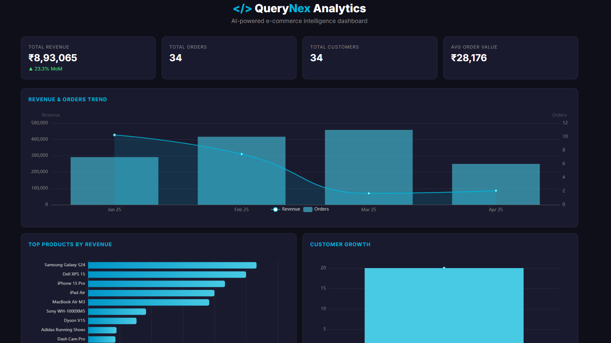
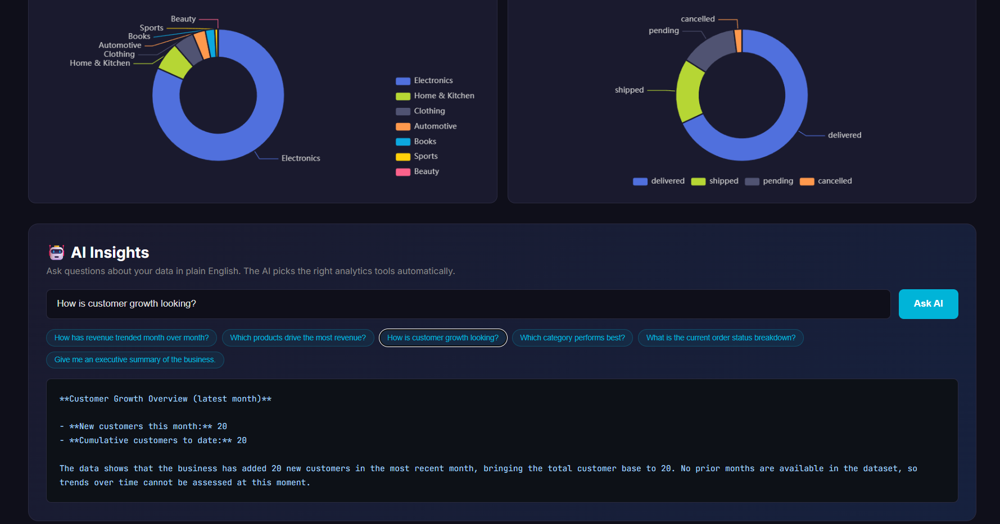

# AI Analytics Dashboard

> AI-powered business intelligence dashboard with natural language insights.

[](https://dotnet.microsoft.com)
[](https://angular.io)
[](https://www.postgresql.org)
[](https://echarts.apache.org)
[](LICENSE)

A modern, full-stack analytics dashboard that visualizes e-commerce KPIs and lets you ask questions in plain English. The AI (via Groq function calling) automatically selects the right analytics functions to answer your question — no SQL required from the user.

---

## 📸 Screenshots

| Dashboard Overview | AI Insights Panel |
|--------------------|-------------------|
|  |  |

---

## ✨ Features

- 📊 **Real-time KPI Cards** — Total revenue, orders, customers, and average order value with MoM change
- 📈 **5 Interactive Charts** — Revenue trend, top products, customer growth, category breakdown, order status
- 🤖 **AI Insights Panel** — Ask business questions in plain English; AI picks the right data tools automatically
- ⚡ **Groq Function Calling** — Fast, deterministic LLM tool-use with `openai/gpt-oss-120b`
- 🗄️ **Materialized Views** — Pre-aggregated analytics for instant dashboard loads
- 🎨 **Modern Dark UI** — Built with Angular 22 signals, `@if`/`@for`, and OnPush change detection
- 📱 **Responsive Design** — Works on desktop, tablet, and mobile
- 🔒 **Secret Management** — .NET User Secrets for API keys and DB credentials

---

## 🏗️ Architecture

```
┌─────────────────────────────────────────────────────────────┐
│                    Angular 22 Dashboard                      │
│  ┌──────────┐ ┌──────────┐ ┌──────────┐ ┌────────────────┐  │
│  │ Revenue  │ │  Top     │ │  User    │ │  AI Insights   │  │
│  │ Trend    │ │ Products │ │  Growth  │ │  (Chat Panel)  │  │
│  │ (Line)   │ │ (Bar)    │ │ (Area)   │ │                │  │
│  └──────────┘ └──────────┘ └──────────┘ └────────────────┘  │
│                                                              │
│              ngx-echarts for all visualizations             │
└──────────────────────────┬──────────────────────────────────┘
                           │ HTTP
                           ▼
┌─────────────────────────────────────────────────────────────┐
│                  .NET 10 Web API                             │
│  ┌──────────────────┐  ┌──────────────────┐                 │
│  │ AnalyticsService │  │ InsightService   │                 │
│  │ (SQL queries)    │  │ (Groq + tools)   │                 │
│  └──────────────────┘  └──────────────────┘                 │
└──────────────────────────┬──────────────────────────────────┘
                           │
                           ▼
┌─────────────────────────────────────────────────────────────┐
│         PostgreSQL (Neon) — e-commerce sample data          │
│   customers · products · orders · order_items · categories  │
│              + materialized views for fast reads            │
└─────────────────────────────────────────────────────────────┘
```

**Request Flow:**
1. Angular loads → fetches KPIs and 5 chart datasets in parallel
2. User asks a question in the AI panel
3. Backend sends the question + tool definitions to Groq
4. Groq picks the right function(s) — e.g., `get_monthly_revenue`, `get_top_products`
5. Backend executes the analytics SQL and returns results to Groq
6. Groq generates a natural language answer
7. Answer is displayed in the AI panel

---

## 🛠️ Tech Stack

| Layer | Technology | Version |
|-------|-----------|---------|
| **Frontend** | Angular (Standalone + Signals) | 22 |
| **Charting** | Apache ECharts via `ngx-echarts` | 5.x |
| **Backend** | .NET Core Web API | 10 |
| **Database** | PostgreSQL | 16+ |
| **AI Provider** | Groq (OpenAI-compatible API) | `openai/gpt-oss-120b` |
| **DB Driver** | Npgsql | Latest |

---

## 📁 Project Structure

```
analytics-dashboard/
├── WebAPI/
│   ├── Controllers/
│   │   └── AnalyticsController.cs
│   ├── Models/
│   │   └── AnalyticsDtos.cs
│   ├── Services/
│   │   ├── AnalyticsService.cs
│   │   └── InsightService.cs
│   ├── Program.cs
│   ├── appsettings.json
│   └── appsettings.Development.json
├── Analytics-Dashboard-UI/
│   └── analytics-dashboard-ui/
│       └── src/
│           ├── app/
│           │   ├── dashboard/
│           │   │   ├── dashboard.ts
│           │   │   ├── dashboard.html
│           │   │   └── dashboard.css
│           │   ├── analytics.service.ts
│           │   ├── app.ts
│           │   ├── app.config.ts
│           │   └── app.routes.ts
│           ├── environments/
│           │   ├── environment.ts
│           │   └── environment.development.ts
│           ├── index.html
│           ├── main.ts
│           └── styles.css
├── database/
│   └── 03_analytics_views.sql
├── docs/
│   └── screenshots/
├── .gitignore
├── LICENSE
└── README.md
```

---

## 🚀 Getting Started

### Prerequisites

- [.NET 10 SDK](https://dotnet.microsoft.com/download/dotnet/10.0)
- [Node.js 22.12+](https://nodejs.org)
- [Angular CLI 22+](https://angular.io/cli) (`npm install -g @angular/cli@latest`)
- [PostgreSQL 16+](https://www.postgresql.org/download/) — or a free [Neon](https://neon.tech) account
- [Groq API Key](https://console.groq.com) — free, no credit card required

---

### 1️⃣ Database Setup

**Option A: Local PostgreSQL**

```bash
# Create database
psql -U postgres -c "CREATE DATABASE ai_sql_demo;"

# Load schema and sample data (from the AI SQL Generator project)
psql -U postgres -d ai_sql_demo -f ../database/01_schema.sql
psql -U postgres -d ai_sql_demo -f ../database/02_sample_data.sql

# Load analytics views
psql -U postgres -d ai_sql_demo -f database/03_analytics_views.sql

# Refresh materialized views
psql -U postgres -d ai_sql_demo -c "SELECT refresh_all_analytics_views();"
```

**Option B: Neon (Free Cloud PostgreSQL)**

1. Sign up at [neon.tech](https://neon.tech) and create a project
2. Copy the connection string from the dashboard
3. Run all three SQL scripts via Neon's SQL Editor:
   - `01_schema.sql` (from AI SQL Generator project)
   - `02_sample_data.sql` (from AI SQL Generator project)
   - `03_analytics_views.sql` (this project)
4. Then run: `SELECT refresh_all_analytics_views();`

---

### 2️⃣ Backend Setup

```powershell
cd WebAPI
dotnet restore
dotnet user-secrets init
```

**Configure secrets (never commit these):**

```powershell
# Groq AI
dotnet user-secrets set "Groq:ApiKey" "gsk_your_actual_key"
dotnet user-secrets set "Groq:Model" "openai/gpt-oss-120b"

# PostgreSQL connection (local)
dotnet user-secrets set "ConnectionStrings:DefaultConnection" `
  "Host=localhost;Port=5432;Database=ai_sql_demo;Username=postgres;Password=yourpassword"

# OR PostgreSQL connection (Neon)
dotnet user-secrets set "ConnectionStrings:DefaultConnection" `
  "Host=ep-xyz-123.aws.neon.tech;Port=5432;Database=neondb;Username=neondb_owner;Password=yourpassword;SSL Mode=Require;Trust Server Certificate=true"
```

**Verify secrets:**

```powershell
dotnet user-secrets list
```

**Run the API:**

```powershell
dotnet run --launch-profile https
```

API will be available at `https://localhost:7249`
Swagger UI: `https://localhost:7249/swagger`

---

### 3️⃣ Frontend Setup

```powershell
cd Analytics-Dashboard-UI/analytics-dashboard-ui
npm install
npm install echarts ngx-echarts
```

**Update the API URL** in `src/environments/environment.development.ts`:

```typescript
export const environment = {
  production: false,
  apiBase: 'https://localhost:7249/api/analytics'
};
```

**Run the dev server:**

```powershell
ng serve --open
```

Frontend: `http://localhost:4200`

---

## 🔌 API Reference

### `GET /api/analytics/summary`

Returns overall KPIs.

**Response:**
```json
{
  "totalRevenue": 1150000.00,
  "totalOrders": 50,
  "totalCustomers": 20,
  "avgOrderValue": 23000.00,
  "revenueChangePercent": 12.5
}
```

---

### `GET /api/analytics/monthly-revenue`

Returns revenue and order counts per month.

**Response:**
```json
[
  { "month": "2025-01-01T00:00:00Z", "orderCount": 10, "uniqueCustomers": 10, "revenue": 250000.00, "avgOrderValue": 25000.00 }
]
```

---

### `GET /api/analytics/top-products?limit=10`

Returns top products by revenue.

**Response:**
```json
[
  { "productId": 4, "name": "Dell XPS 15", "category": "Electronics", "unitsSold": 1, "revenue": 149999.00 }
]
```

---

### `GET /api/analytics/customer-growth`

Returns new and cumulative customer counts per month.

---

### `GET /api/analytics/revenue-by-category`

Returns revenue and units sold grouped by product category.

---

### `GET /api/analytics/order-status`

Returns order count and value grouped by status.

---

### `POST /api/analytics/insights`

Ask a natural language question; the AI returns a written answer.

**Request:**
```json
{
  "question": "Which products drive the most revenue?"
}
```

**Response:**
```json
{
  "answer": "The top revenue driver is the Dell XPS 15 at ₹149,999, followed by the iPhone 15 Pro and MacBook Air M3. Electronics dominate overall revenue...",
  "chartJson": null,
  "error": null
}
```

---

## 🤖 How AI Function Calling Works

Instead of the AI writing raw SQL (which is risky), this project uses **tool calling**:

1. Backend defines 6 available analytics functions (revenue, products, growth, category, status, summary)
2. User asks a question
3. Backend sends the question + tool definitions to Groq
4. Groq decides which tools to call — no code injection risk, no unsafe SQL
5. Backend executes the safe, pre-defined queries
6. Groq summarizes the results in plain English

**Example:**

| User Question | Tools Groq Calls |
|---------------|------------------|
| "How has revenue trended?" | `get_monthly_revenue` |
| "Top 5 products?" | `get_top_products(limit=5)` |
| "Executive summary?" | `get_summary` + `get_monthly_revenue` + `get_customer_growth` |

This pattern is safer than free-form SQL generation because:
- Only whitelisted queries run
- No SQL injection surface
- Deterministic, testable

---

## 🗄️ Database Views

| View | Purpose |
|------|---------|
| `mv_monthly_revenue` | Revenue, order count, unique customers per month |
| `mv_top_products` | Product revenue and units sold |
| `mv_customer_growth` | New customers + cumulative total per month |
| `mv_revenue_by_category` | Revenue and units sold per category |
| `mv_order_status` | Order count and value by status |

Refresh after data changes:

```sql
SELECT refresh_all_analytics_views();
```

---

## 🔒 Security

| Protection | Implementation |
|------------|---------------|
| **AI safety** | Function calling — AI can only invoke whitelisted queries |
| **Secrets management** | .NET User Secrets (never committed) |
| **CORS** | Restricted to the Angular dev origin |
| **No raw SQL exposure** | Queries are pre-built and parameterized |
| **SSL to database** | Neon requires `SSL Mode=Require` |

---

## 🧪 Sample Questions to Try

| Question | What It Demonstrates |
|----------|---------------------|
| `How has revenue trended over time?` | Line chart analysis |
| `Which products drive the most revenue?` | Top products query |
| `How is customer growth looking?` | Growth analysis |
| `Which category performs best?` | Category breakdown |
| `Give me an executive summary` | Multi-tool orchestration |
| `What is the current order status breakdown?` | Status distribution |

---

## ☁️ Deployment

| Component | Recommended Service | Free Tier |
|-----------|--------------------|-----------|
| **Frontend** | Azure Static Web Apps | 500 MB, 100 GB bandwidth/month |
| **Backend** | Azure App Service (F1) | 1 GB disk, 60 min CPU/day |
| **Database** | Neon | 0.5 GB storage, auto-suspend |
| **AI** | Groq | Generous free tier |

**Production `appsettings.json`** should reference environment variables for secrets, not hard-coded values.

**Update `environment.ts`** with your production API URL before deploying:

```typescript
export const environment = {
  production: true,
  apiBase: 'https://your-api.azurewebsites.net/api/analytics'
};
```

---

## 🧗 Challenges Solved

- **ECharts bundle size** — Initial bundle exceeded Angular's default 500 KB budget; raised to 1.5 MB warning / 2 MB error (gzipped size is ~250 KB, well within reason)
- **Angular 22 class naming** — New convention uses `App` instead of `AppComponent`; updated `main.ts` and `app.ts` accordingly
- **AI safety** — Chose function calling over raw SQL generation to eliminate injection risk
- **Fast dashboard loads** — Materialized views pre-aggregate data so charts render instantly
- **Duplicate config keys** — Moved secrets out of `appsettings.Development.json` into user-secrets
- **Groq model deprecation** — Migrated from `llama-3.3-70b-versatile` to `openai/gpt-oss-120b`

---

## 🤝 Contributing

Contributions, issues, and feature requests are welcome!

1. Fork the repository
2. Create a feature branch (`git checkout -b feature/amazing-feature`)
3. Commit your changes (`git commit -m 'Add amazing feature'`)
4. Push the branch (`git push origin feature/amazing-feature`)
5. Open a Pull Request

---

## 📄 License

This project is licensed under the MIT License — see the [LICENSE](LICENSE) file for details.

---

## 👤 Author

**QueryNex**
- Portfolio: [querynexai.github.io](https://querynexai.github.io)
- GitHub: [@querynexai](https://github.com/querynexai)
- Email: querynex.ai@outlook.com

---

## ⭐ Show Your Support

If this project helped you, please give it a star ⭐ — it helps others discover it too.

---

## 🙏 Acknowledgements

- [Apache ECharts](https://echarts.apache.org) for the powerful charting library
- [ngx-echarts](https://github.com/xieziyu/ngx-echarts) for the Angular wrapper
- [Groq](https://groq.com) for fast, free AI inference
- [Neon](https://neon.tech) for serverless PostgreSQL
- The open-source .NET, Angular, and PostgreSQL communities